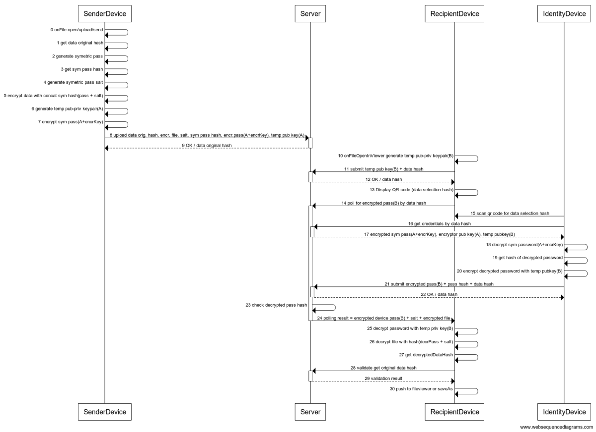

 

# Client API

We are glad to receive any feedback you want to give us. 

You can find the **documentation [here](docs/index.md)**.

You can find the **npm package [here](https://www.npmjs.com/package/recheck-clientjs-library)**.

To connect to server you can use __https://beta.recheck.io__ .

To tryout some of the possibilities of the library you can use our __CLI tool [hammer](https://github.com/ReCheck-io/hammerJS)__.

## About the library 

This is a reference implementation of a protocol for end-to-end encryption with the Recheck services platform. It implements data storage, fetching and validation with a set of keypairs that support ethereum and aeterntiy digital signatures. 

## How it is working

The protocol consists of a client - sending browser, server, receiving browser and receiving device (which is supposed to be your mobile phone ). Between those four entities two sets of PKI key pairs are taking part into sending the data across them. 

The first set is that of the user. It is being created(or more precisely revealed) with the creation of the user's account/wallet. With it, the user can operate with the service we provide. Moreover, upon uploading, the client is using this set to encrypt the file that is being uploaded on ReCheck servers. __By doing this we enforce the good practices of privacy by design and cannot read or in fact know anything about your file.__

The second set is created to the mediator browser that will get the file and do some of the said actions. The mediator browser is treated like an user thus creating even more security between the data trasportation. 

The full protocol is illustrated in the diagram below, you can have a better look at each step in [here](docs/WebSequenceDiagram.md).

## Explanation of the nature of the product 

Recheck has seen the need to provide tools for reliable and privacy focused data exchange with verifiable evidences on the blockchain. The tools developed by Recheck are achieving this through a platform deployed at https://beta.recheck.io and accessed via a client library.

### why cryptography 

In the era of Information, everything has a digital representation. Cryptography is only natural response to protect a valuable information. Thus we saw the need to establish an environment with variaty of tools to create a safe path for information to be stored and transferred from A to B. In our [blog post](https://recheck.io/blog/guard-data-integrity/) about guarding your data integrity in business you can learn even more about the essentiality and importance of cryptography in our days. 

### why blockchain
