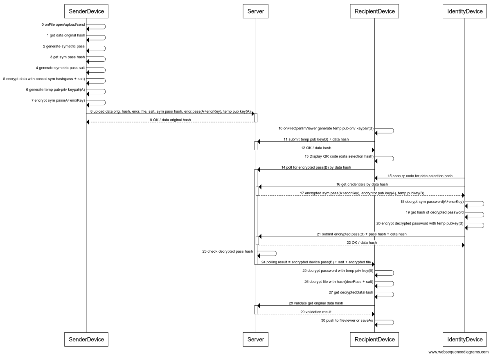

Put the following code on https://www.websequencediagrams.com/ to get the **Sequence diagram** if you want to make any changes. 
 
```
SenderBrowser->SenderBrowser: 0 onFile open/upload/send
SenderBrowser->SenderBrowser: 1 get data original hash
SenderBrowser->SenderBrowser: 2 generate symetric pass
SenderBrowser->SenderBrowser: 3 get sym pass hash
SenderBrowser->SenderBrowser: 4 generate symetric pass salt
SenderBrowser->SenderBrowser: 5 encrypt data with concat sym hash(pass + salt)
SenderBrowser->SenderBrowser: 6 generate temp pub-priv keypair(A)
SenderBrowser->SenderBrowser: 7 encrypt sym pass(A+encrKey)
SenderBrowser->+Server: 8 upload data orig. hash, encr. file, salt, sym pass hash, encr.pass(A+encrKey), temp pub key(A)
Server-->-SenderBrowser: 9 OK / data original hash
RecBrowser->RecBrowser: 10 onFileOpenInViewer generate temp pub-priv keypair(B)
RecBrowser->+Server: 11 submit temp pub key(B) + original data hash
Server-->-RecBrowser: 12 OK / data original hash
RecBrowser->RecBrowser: 13 Display QR code (data original hash)
RecBrowser->+Server: 14 poll for encrypted pass(B) by data original hash
RecDevice->RecBrowser: 15 scan qr code for original hash
RecDevice->+Server: 16 get credentials by data original hash from QR
Server-->-RecDevice: 17 encrypted sym pass(A+encrKey), encryptor pub key(A), temp pubkey(B)
RecDevice->RecDevice: 18 decrypt sym password(A+encrKey)
RecDevice->RecDevice: 19 get hash of decrypted password
RecDevice->RecDevice: 20 encrypt decrypted password with temp pubkey(B)
RecDevice->+Server: 21 submit encrypted pass(B) + pass hash + data original hash
Server-->-RecDevice: 22 OK / data original hash
Server->Server: 23 check decrypted pass hash
Server->-RecBrowser: 24 polling result = encrypted device pass(B) + salt + encrypted file
RecBrowser->RecBrowser: 25 decrypt password with temp priv key(B)
RecBrowser->RecBrowser: 26 decrypt file with hash(decrPass + salt)
RecBrowser->RecBrowser: 27 get decryptedDataHash
RecBrowser->+Server: 28 validate decryptedDataHash
Server-->-RecBrowser: 29 validation result
RecBrowser->RecBrowser: 30 push to fileviewer or saveAs
```

